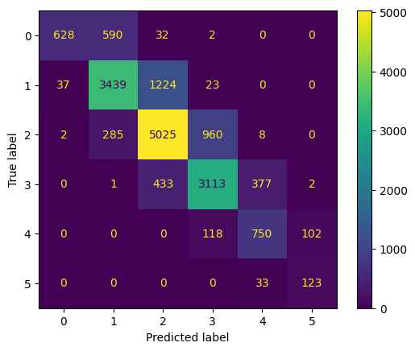

# Automated-Essay-Scoring-2.0
 
## Overview
GitHub repo of the 1,495th place solution for the Kaggle Competition : [Automated Essay Scoring 2.0](https://www.kaggle.com/competitions/learning-agency-lab-automated-essay-scoring-2/overview) by the Learning Agency Lab. 

Final performance:

* 0.821 private LB
* 0.808 public LB

## Usage
This project was run on Kaggle using the T4 GPUs for accelerated training and inference. To replicate the setup:

 1.	Set Up Kaggle Environment:
    *	Navigate to Kaggle and create an account if you don’t have one.
    *	Create a new notebook and select the T4 x 2 GPU accelerator.
 3.	Import Data and Code:
    *	Import the competition dataset
    *	Upload code from this repository to your Kaggle notebook.
 3. Run each LLM models-preload python files
 4. Run inference python file
    *   Import post-run files to the inference Kaggle notebook 

## Final Approach

* Fine-Tuning LLMs: Using Hugging Face AutoModelForSequenceClassification (num_labels=1), three pre-trained LLMs were fine-tuned to the dataset.   
  * Longformer - 2048 max embeddings
  * DeBerta V3 small - 1024 max embeddings
  * XLNet - 1024 max embeddings
* Ensemble Averaging: Predictions from the three fine-tuned models were averaged.
* Optuna Hyperparameter Tuning: Generated optimized thresholds for classification. [(source)](https://www.kaggle.com/code/rsakata/optimize-qwk-by-lgb/notebook)

## Approaches Not Included in Final Submission

Early submissions scored as low as LB 0.59 and gradually improved over the competition. Things that did not improve performance:

* Embedding extraction with MLP Classifier
* Adding persuade corpus 2.0 data into the training set
* Stratified K-fold training
* Fine-tuning LLMs with 512 max embeddings
* Ensembling 6+ models
* AutoModelForSequenceClassification (num_labels=6)

## Contact
For any questions or comments, please connect with me on [LinkedIn](www.linkedin.com/in/nolan-clark-a64bb11b3)
